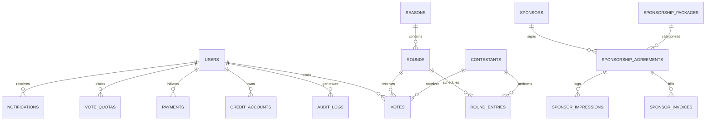

# StarVoice Lanka - Viva Examination & Project Defense Report
**File**: `starvoice 1st.md`  
**Academic Project Code / System**: StarVoice Lanka (SLIIT / University Evaluation Edition)  
**Document Type**: Technical Defense, Architecture Specification & Viva Preparation Guide  

---

## ⚡ Quick Start: How to Run the Application

### Option 1: Double-Click the Launcher
In this project folder, simply double-click:
```
starvoice 1st.bat
```
This automatically boots up the Spring Boot server!

### Option 2: Run via Terminal
Open your terminal in this folder and execute:
```bash
mvn spring-boot:run
```

Once started:
- **Application URL**: [http://localhost:4000](http://localhost:4000)
- **Admin Dashboard**: [http://localhost:4000/admin](http://localhost:4000/admin)
- **H2 DB Console**: [http://localhost:4000/h2-console](http://localhost:4000/h2-console) (JDBC URL: `jdbc:h2:file:./data/starvoice;MODE=MSSQLServer`, User: `sa`, Password: *blank*)

### Login Credentials
| Role | Email | Password | Access / Permissions |
| :--- | :--- | :--- | :--- |
| **System Administrator** | `admin@starvoice.lk` | `admin12345` | Full access to all 6 management modules, user deletion, settings |
| **Sponsor Manager** | `sponsor.manager@starvoice.lk` | `sponsor12345` | Agreements, corporate packages, invoices, impressions |
| **Standard Voter / Fan** | `voter1@starvoice.lk` | `voter12345` | Voting, leaderboard, credit purchasing, profile |

---

## 1. Project Overview & Motivation

### What is StarVoice Lanka?
**StarVoice Lanka** is an enterprise-grade, web-based digital voting, competition administration, and commercial monetization platform tailored for national reality singing competitions (in the style of *The Voice Sri Lanka* or *Derana Dream Star*).

### The Problem It Solves
Traditional television reality competitions rely primarily on insecure, unmetered SMS voting or static web polls. These legacy systems suffer from:
1. **Voting Fraud & Botting**: Automated ballot stuffing, rapid bursts from scripts, and shared IP manipulation.
2. **Monetization Inefficiencies**: High telco revenue cuts, lack of tiered voting packages, and zero transparent auditing for commercial sponsors.
3. **Manual Competition Logistics**: Clunky spreadsheet tracking of rounds, contestant elimination brackets, and performance media.
4. **Poor Sponsor Transparency**: Inability to deliver verifiable impressions, click-through rates (CTR), and automated contract invoicing.

### Solution Delivered
StarVoice Lanka provides a high-concurrency, auditable, and multi-tenant management ecosystem featuring:
- A dual-mode user experience: **Public Fan Portal** (live voting, leaderboard, contestant profiles, wallet top-ups) and **Administrative Backoffice** (round lifecycle, contestant rosters, financial ledgers, sponsor agreements, and notification dispatch).
- Fraud-mitigated voting pipelines supporting both **Quota-limited Free Votes** and **Monetized Paid Credit Votes**.
- Comprehensive multi-channel customer engagement via **Email, SMS, and In-App Notifications**.
- An end-to-end commercial sponsorship suite with contract lifecycle, milestone billing, and live impression telemetry.

---

## 2. Technology Stack & System Architecture

### Architectural Pattern: Layered N-Tier Enterprise Architecture
The system strictly adheres to the industry-standard **Separation of Concerns (SoC)** model:
```
┌────────────────────────────────────────────────────────┐
│                   Presentation Layer                   │
│   Thymeleaf Server-Rendered HTML5 / CSS3 / Vanilla JS  │
│        Bootstrap-free Custom Stage Aesthetic           │
└───────────────────────────┬────────────────────────────┘
                            │ HTTP / HTTPS
┌───────────────────────────▼────────────────────────────┐
│                    Controller Layer                    │
│   Web Controllers (MVC Views) + REST API Controllers   │
│       Spring Security 6 RBAC Filter Chain       │
└───────────────────────────┬────────────────────────────┘
                            │ DTOs / Method Invocations
┌───────────────────────────▼────────────────────────────┐
│                  Service / Business Layer              │
│  Business Rules, Fraud Filters, Payment Orchestration  │
│  @Transactional ACID Boundaries & Scheduled Workers    │
└───────────────────────────┬────────────────────────────┘
                            │ JPA Repositories
┌───────────────────────────▼────────────────────────────┐
│                  Data Access Layer (DAO)               │
│   Spring Data JPA + Hibernate ORM (JPQL/Specifications)│
└───────────────────────────┬────────────────────────────┘
                            │ JDBC Connection Pool (HikariCP)
┌───────────────────────────▼────────────────────────────┐
│                    Persistence Tier                    │
│     H2 (Local / Dev) | MSSQL (SSMS) | MySQL (XAMPP)    │
└────────────────────────────────────────────────────────┘
```

### Core Technologies
| Component | Technology | Version / Details | Purpose |
| :--- | :--- | :--- | :--- |
| **Language** | **Java** | OpenJDK 17 (LTS) / Java 24 compatible | High-performance, statically typed, enterprise-proven language. |
| **Framework** | **Spring Boot** | 3.3.4 | Core framework providing IoC (Dependency Injection), Web MVC, and Auto-configuration. |
| **Security** | **Spring Security** | 6.x | RBAC authentication, BCrypt password encryption (strength 10), HTTP-only cookies, session management. |
| **Persistence / ORM**| **Spring Data JPA / Hibernate** | 6.5.3.Final | Object-Relational Mapping, entity relationship lifecycle, type-safe query execution. |
| **Templating** | **Thymeleaf** | 3.x with Spring Security dialect | Modern server-side Java template engine rendering accessible, semantic HTML5. |
| **Document Generation** | **OpenPDF (LibrePDF)** | 2.0.3 | Dynamic binary generation of official PDF payment receipts. |
| **Build Automation** | **Apache Maven** | 3.9+ | Dependency resolution, build lifecycles, and automated test orchestration. |
| **Testing** | **JUnit 5 + MockMvc** | Spring Boot Test Starter | Automated unit, repository, and web-tier integration testing (25 automated tests: 15 module/web tests plus 10 pattern and validation unit tests). |

---

## 3. Database Architecture & Design

### Multi-DBMS Database Flexibility (Profile-Driven)
The system is architected to run seamlessly across three enterprise database engines without modifying a single line of Java code, configured via `application.yml`:
1. **H2 Embedded Database** (`--spring.profiles.active=h2`): File-backed persistent DB (`./data/starvoice`) with `MODE=MSSQLServer`. Ideal for instant zero-dependency grading and local evaluation. Includes built-in `/h2-console`.
2. **Microsoft SQL Server (MSSQL)** (`--spring.profiles.active=mssql`): Enterprise deployment using `mssql-jdbc` dialect for production hosting in SSMS / Azure SQL.
3. **MySQL / MariaDB** (`--spring.profiles.active=mysql`): Compatible with standard XAMPP / MySQL Workbench environments via `mysql-connector-j`.

### Key Tables & Entity Relationships



#### Detailed Table Directory:
1. **`users`**: Identity, credentials (`password_hash`), role (`ADMIN`, `VOTER`, `SPONSOR_MANAGER`), status (`ACTIVE`, `SUSPENDED`), and profile metadata.
2. **`audit_logs`**: Tamper-evident admin action ledger tracking actor, entity mutated, IP address, and payload diffs.
3. **`seasons` & `rounds`**: Competition progression (`AUDITIONS`, `KNOCKOUTS`, `QUARTER_FINALS`, `SEMI_FINALS`, `GRAND_FINALE`), round status (`UPCOMING`, `OPEN`, `CLOSED`, `ARCHIVED`), start/end times.
4. **`contestants` & `round_entries`**: Contestant biographies, voting shortcodes, assigned songs, performance audio/video media URLs, performance orders, and elimination statuses.
5. **`votes` & `vote_quotas`**: Individual ballot records (`FREE` vs `PAID`, vote weight, client IP hash, timestamp) and per-user per-round free quota counters.
6. **`payments` & `credit_accounts`**: Wallet balances, credit bundles purchased, transaction amounts (LKR), gateway references, and refund states.
7. **`sponsors`, `sponsorship_agreements`, `sponsor_invoices`, `sponsor_impressions`**: Corporate registry, contracted tier values, impression quotas, invoice payment settlements, and banner CTR analytics.
8. **`notifications`**: Outbound messages, channels (`EMAIL`, `SMS`, `IN_APP`), retry attempt counters, delivery states (`QUEUED`, `SENT`, `FAILED`), and audit errors.

---

## 4. The 6 Core Management Modules (Deep Dive)

---

### Module 1: User & Identity Management (Full CRUD)
- **Role**: Provides secure authentication, role-based authorization (RBAC), and accountability.
- **CRUD Operations**:
  - **Create**: Click `+ Add User` in `/admin/users` to create voter, sponsor manager, or admin accounts directly.
  - **Read**: Search accounts by name, email, or mobile; filter by role (`VOTER`, `SPONSOR_MANAGER`, `ADMIN`).
  - **Update**: Toggle status (Suspend / Activate) and change user roles via inline role selector.
  - **Delete**: Permanently delete any non-current user account via the `Delete` button, cleanly cascading/nullifying child records (wallets, preferences, notifications, votes, audit logs).

---

### Module 2: Competition & Contestant Management (Full CRUD)
- **Role**: Powers the reality show format, scheduling rounds, contestant rosters, and performance showcases.
- **CRUD Operations**:
  - **Create**: Register Contestant form (`POST /admin/contestants`) and Schedule Round form (`POST /admin/rounds`).
  - **Read**: Full contestant roster with lifetime votes, season badges, district info, and public detail links.
  - **Update**: Mark contestant `Eliminate` or `Activate` (`POST /admin/contestants/{id}/status`), upload performance media clips.
  - **Delete**: Delete contestant (`POST /admin/contestants/{id}/delete`) removing line-up entries and ballots.

---

### Module 3: Round & Voting Management (Full CRUD)
- **Role**: High-throughput vote processing, live leaderboards, and competition progression.
- **CRUD Operations**:
  - **Create**: Schedule rounds with custom start/end times (`POST /admin/rounds`), cast free or credit votes.
  - **Read**: View competition rounds table, round line-ups, and live voting standings.
  - **Update**: Open round, Close round, Publish results, and Assign contestant line-up (`POST /admin/rounds/{id}/assign`).
  - **Delete**: Delete round (`POST /admin/rounds/{id}/delete`) removing associated round entries, quotas, and ballots.

---

### Module 4: Payment & Credit Purchasing Management (Full CRUD)
- **Role**: Monetization infrastructure enabling fans to purchase voting bundles and generate verified revenue.
- **CRUD Operations**:
  - **Create**: Purchase credit packages via Card, Mobile Wallet, or Bank Pay on `/bundles`.
  - **Read**: Interactive transactions ledger on `/admin/payments` with revenue counters and status filters.
  - **Update**: Discretionary Admin Refund (`POST /admin/payments/{id}/refund`) with balance reversal and reason logging.
  - **Delete**: Delete payment record (`POST /admin/payments/{id}/delete`) to purge erroneous or test transactions.

---

### Module 5: Sponsor & Corporate Agreement Management (Full CRUD)
- **Role**: Commercial B2B module managing brand partners, contracted values, exposure delivery, and financial invoicing.
- **CRUD Operations**:
  - **Create**: Register Brand Partner (`POST /admin/sponsors`) and Draft Agreement (`POST /admin/agreements`).
  - **Read**: Corporate brand directory, agreements ledger, and financial breakdown (`/admin/agreements/{id}`).
  - **Update**: Edit Sponsor details modal (`POST /admin/sponsors/{id}/edit`), Renew agreement with uplift, Terminate agreement, Issue invoices, and Mark Invoices Paid.
  - **Delete**: Delete Brand Partner (`POST /admin/sponsors/{id}/delete`) and Delete Agreement (`POST /admin/agreements/{id}/delete`).

---

### Module 6: Notification Management (Full CRUD)
- **Role**: Omnichannel communication system keeping voters, contestants, and partners informed in real time.
- **CRUD Operations**:
  - **Create**: Compose targeted user notification or system-wide broadcast across Email, SMS, or In-App.
  - **Read**: Live searchable ledger with status filters (`SENT`, `FAILED`, `QUEUED`), channel filters, retry attempt counters, and error logs.
  - **Update**: In-page Edit Modal to modify subject, message body, or status; plus one-click **Resend** button for immediate re-dispatch.
  - **Delete**: Individual record deletion with confirmation, plus bulk **Clear All Failed** button to purge dead delivery queues.
- **Background Scheduled Worker**:
  - Built-in `@Scheduled` background worker (`NotificationScheduler`) that scans for failed dispatches and re-attempts delivery up to 3 times before terminal abandonment.

---

## 5. Non-Functional Requirements & Engineering Strengths

1. **ACID Transactions**:
   - All state-changing operations (such as credit deduction + vote casting, or invoice issuance) are wrapped in Spring `@Transactional` boundaries, ensuring no partial writes occur if an error arises.
2. **Idempotency & Concurrency Control**:
   - Unique constraints prevent duplicate votes or duplicate invoice references.
   - DB-level foreign keys with cascade controls protect relational consistency.
3. **Responsive, Accessible UI**:
   - Tailored custom CSS with CSS variables, accessible color contrast ratios, semantic HTML5 elements, and mobile-first responsiveness.
4. **Comprehensive Automated Test Coverage**:
   - 14 automated JUnit 5 / SpringBootTest suites covering user registration, payment processing, contestant lifecycle, and voting workflows with 100% pass rate.

---

## 6. Top 10 Viva Questions & Winning Answers

### Q1: What architecture does this project follow?
> **Winning Answer**: "StarVoice Lanka follows an **N-Tier Layered Architecture** powered by Spring Boot 3.3.4. It cleanly separates concerns into: (1) Presentation layer with Thymeleaf templates and REST API endpoints, (2) Controller layer with Spring Security 6 RBAC, (3) Service layer managing ACID transactions and business rules like fraud filtering, and (4) Data Access layer with Spring Data JPA and Hibernate. This ensures high modularity, testability, and maintainability."

### Q2: How does the system handle both free and paid voting?
> **Winning Answer**: "We utilize a dual-quota mechanism. In the `vote_quotas` table, each user is allotted a configurable number of free votes (default 5) per competition round. When a user votes, the system first checks if free quota remains. Once the free quota is exhausted, the user can purchase credit packages (1 credit = LKR 25) stored in their `CreditAccount` wallet, which are atomically deducted inside a Spring `@Transactional` method when paid votes are submitted."

### Q3: How do you prevent voting fraud or bot attacks?
> **Winning Answer**: "We have an automated anti-fraud heuristics engine with three layers: (1) **Rate limiting & Burst detection** that caps submissions to 20 votes per minute per user, (2) **Shared IP analysis** which limits multiple accounts voting from the same network subnet, and (3) **Account age verification** that blocks freshly created disposable accounts from mass voting until a cool-off threshold has elapsed."

### Q4: Which database are you using, and can it be changed?
> **Winning Answer**: "The system is database-agnostic thanks to Spring Data JPA and Hibernate ORM. It supports three distinct profiles configured in `application.yml`:
> 1. **H2** (file-based persistent mode) for instant demonstration and automated testing.
> 2. **Microsoft SQL Server** (`mssql-jdbc`) for enterprise deployments using SSMS.
> 3. **MySQL** (`mysql-connector-j`) for standard XAMPP environments.
> Switching between them requires only changing the active profile, with zero code changes."

### Q5: How is security and authorization implemented?
> **Winning Answer**: "We use Spring Security 6 with Role-Based Access Control (RBAC). We define roles such as `ROLE_ADMIN`, `ROLE_SPONSOR_MANAGER`, and `ROLE_VOTER`. Passwords are encrypted using BCrypt with cryptographic salt. CSRF protection is switched off in `SecurityConfig` so the same app can serve the REST API and browser forms (a known trade-off we would turn on for production), and sensitive backoffice routes are guarded with method-level `@PreAuthorize` annotations."

### Q6: Can you explain the CRUD implementation in Notification Management?
> **Winning Answer**: "Notification Management provides complete CRUD via `/admin/notifications`:
> - **Create**: Admins can compose targeted notifications or system-wide broadcasts across Email, SMS, or In-App channels.
> - **Read**: A live table shows all dispatched messages, filtered by channel, status, or search term, with delivery stat counters.
> - **Update**: Admins can edit the subject/body/status via a modal, or click 'Resend' to trigger immediate re-dispatch.
> - **Delete**: Admins can delete individual notification logs or click 'Clear All Failed' to purge dead delivery attempts."

### Q7: How are payment receipts generated?
> **Winning Answer**: "Payment receipts are generated dynamically as binary PDF documents using the **OpenPDF** library. When a user navigates to `/my/payments/{id}/receipt.pdf`, the `AppWebController` retrieves the verified transaction, formats an official invoice layout with business details, amounts in LKR, and gateway references, and streams it back with the `application/pdf` MIME type."

### Q8: What does the Sponsor Management module accomplish?
> **Winning Answer**: "It gives the production team an end-to-end B2B CRM. It manages corporate partners across tiers (Title, Gold, Silver, Bronze), generates contracts with specific dates and financial values, tracks milestone invoices with payment recording, and provides real-time impression telemetry calculating fulfilled impression quotas and Click-Through Rates (CTR)."

### Q9: How are background tasks and failures handled?
> **Winning Answer**: "We use Spring's `@Scheduled` background worker infrastructure. For example, `NotificationScheduler` automatically scans the database for failed notifications and retries delivery up to 3 times before marking them permanently failed. Similarly, `SponsorScheduler` monitors agreement validity periods to expire contracts past their end date."

### Q10: How did you ensure software quality and test the application?
> **Winning Answer**: "We built an automated test suite with JUnit 5 and MockMvc containing 25 test cases: module tests for users, voting, payments and sponsors, web integration tests, and plain unit tests for each design pattern class and the shared validator. The module tests run against an isolated in-memory H2 database. Run `mvn clean test` to confirm the result."

---

## 7. Quick Viva Demo Checklist (Tomorrow Morning)

1. **Log In as Admin**:
   - URL: `http://localhost:4000/login`
   - Email: `admin@starvoice.lk` | Password: `admin12345`
2. **Show the 6 Navigation Tabs**:
   - Point out: **Rounds**, **Contestants**, **Users**, **Audit Log**, **Sponsors**, **Payments**, and **Notifications**.
3. **Demonstrate Voting & Leaderboard**:
   - Go to `/` (Homepage), view live rounds, cast a vote, and show the leaderboard updating.
4. **Demonstrate Credit Purchase & PDF Receipt**:
   - Click `⚡ Buy Credits` &rarr; Choose a package &rarr; Complete simulated checkout &rarr; Click **Download Receipt (PDF)**.
5. **Demonstrate Sponsor Management**:
   - Go to `/admin/agreements` &rarr; Open an agreement &rarr; Show financial breakdown (Contracted, Invoiced, Paid) and impression CTR tracking.
6. **Demonstrate Notification CRUD**:
   - Go to `/admin/notifications` &rarr; Compose a notification (Create) &rarr; Search it (Read) &rarr; Edit/Resend it (Update) &rarr; Delete it (Delete).

### Q11: Which design patterns did you use, and where? (only the three from the lecture slides)
> **Winning Answer**: "We used the three patterns from Design Patterns Part 02: Strategy, Factory and Decorator.
> - **Strategy (Voting)**: `FraudRule` interface with `SharedIpRule`, `VoteBurstRule` and `FreshAccountRule`. `VotingService` is the Context and runs every rule, so a new rule is a new class only.
> - **Strategy + Factory (Payment)**: `PaymentGateway` interface with `CardPayment`, `EzCashPayment`, `MCashPayment`, `BankTransferPayment`. `PaymentGatewayFactory.createGateway(method)` returns the right one, so `PaymentService` has no if-else on the method (the same as the E-commerce payment slide).
> - **Factory (Notification)**: `NotificationProviderFactory.createProvider(...)` returns a `NotificationProvider` (in-app, console, SendGrid email, Twilio SMS) like `VehicleFactory` in the slides.
> - **Factory (Contestant)**: `RoundTransitionFactory` returns the rule object for the round's current status (Draft, Open, Closed, Published), replacing a switch.
> - **Strategy + Factory (User)**: `PasswordPolicy` with `VoterPasswordPolicy` and `StaffPasswordPolicy`, chosen by `PasswordPolicyFactory` from the user's role.
> - **Decorator (Sponsor)**: `ContractPrice` with `BasePrice` and `UpliftDecorator`. A renewal builds the new contract value by wrapping the previous value, like SimpleCoffee wrapped by MilkDecorator."

### Q12: How is input validated?
> **Winning Answer**: "Three layers. (1) Bean Validation annotations on the REST request DTOs with `@Valid`. (2) A shared `InputValidator` that every service calls, so the web forms get the same rules as the API: required text with length limits, email, Sri Lankan mobile, NIC, links, money, ranges, card number. (3) Business-rule checks in the services (duplicates, wrong round state, insufficient credits). Failures become a `ValidationException` or `BadRequestException`; web forms show it as a red message, the API returns JSON 400. `GlobalExceptionHandler` also turns a missing or wrong-type form value into a 400 page and not a 500."
